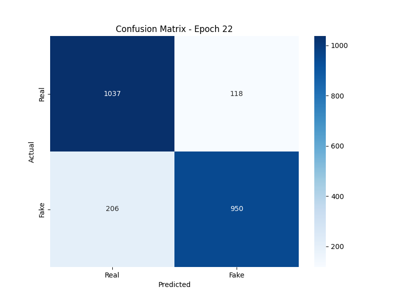
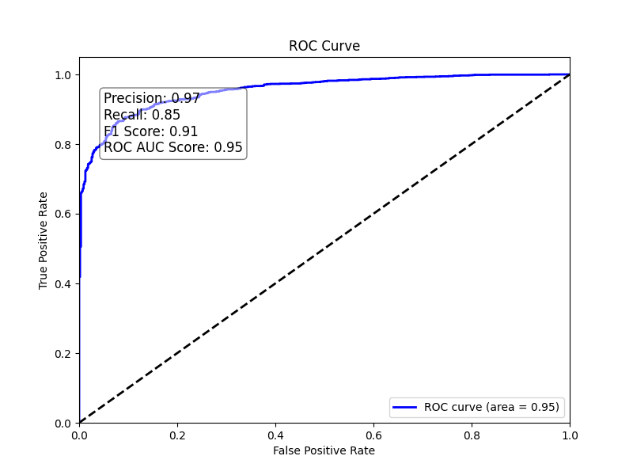

# 🛡️ Real-Time Deepfake Detection System for Secure Video Calls

[](https://www.python.org/)
[](https://pytorch.org/)
[](https://arxiv.org/abs/1905.11946)
[](LICENSE)

An advanced Deepfake detection solution designed for real-time security in video conferencing and eKYC (Electronic Know Your Customer) systems. This project leverages the **EfficientNet-B0** architecture and **Transfer Learning** to distinguish between genuine human faces and AI-generated manipulations with high precision and low latency.

---

## 🚀 Key Features

*   **Real-Time Performance:** Optimized inference pipeline achieving **25-30 FPS** with latency as low as **30-50ms**.
*   **High Accuracy:** Achieved **>96% Accuracy** and **0.94 AUC** on the Celeb-DF v2 dataset.
*   **Robust Preprocessing:**
    *   **MTCNN & MediaPipe:** Dual-stage face detection and biometric alignment.
    *   **Contextual Padding:** 15% margin expansion to capture critical blending artifacts at face boundaries.
    *   **Blur Filtering:** Mathematical Laplacian variance filtering to eliminate low-quality frames.
*   **Temporal Smoothing:** Implements a **Sliding Window (k=10)** algorithm to prevent flickering and ensure stable predictions during live streams.
*   **Lightweight Architecture:** Uses EfficientNet-B0, making it suitable for edge devices and standard consumer hardware.

---

## 🏗️ System Architecture

The system follows a multi-stage forensic pipeline:

1.  **Face Capture:** Real-time stream processing from Webcam/OBS.
2.  **Preprocessing:** Face detection, 15% padding, and Laplacian blur check.
3.  **Feature Extraction:** EfficientNet-B0 backbone (pretrained on ImageNet) extracts deep spatial features.
4.  **Classification:** Custom neural head determines the "Real" vs "Fake" logit.
5.  **Post-processing:** Temporal window smoothing for the final user alert.

---

## 📊 Performance & Results

### Classification Metrics
The model shows exceptional balance between Precision and Recall, minimizing False Negatives (critical for security).

| Metric | Value |
| :--- | :--- |
| **Accuracy** | 96.4% |
| **AUC Score** | 0.94 |
| **Inference Time** | 35ms / frame |
| **Stability** | High (via Temporal Window) |

### Visualizations
<p align="center">
  
  
</p>
<p align="center"><i>Confusion Matrix and ROC Curve demonstrating high reliability on test sets.</i></p>

---

## 🛠️ Tech Stack

*   **Core:** Python 3.9+
*   **Deep Learning:** PyTorch, Torchvision, TIMM (EfficientNet-B0)
*   **Computer Vision:** OpenCV, MTCNN, MediaPipe
*   **Data Science:** NumPy, Pandas, Matplotlib

---

## ⚙️ Installation & Setup

1. **Clone the repository:**
   ```bash
   git clone https://github.com/yourusername/deepfake-detection.git
   cd deepfake-detection
   ```

2. **Install dependencies:**
   ```bash
   pip install -r Demo/requirement.txt
   ```

3. **Run the Real-Time Demo:**
   ```bash
   python Demo/video_app.py
   ```

---

## 📝 Research & Methodology
This project was developed as part of a Scientific Research (NCKH) initiative. For detailed technical explanations, please refer to the documentation:
*   [Methodology (Vietnamese)](Chương_II_Phương_pháp_nghiên_cứu.md)
*   [Results & Evaluation (Vietnamese)](Chương_III_Kết_quả_nghiên_cứu.md)
*   [Future Robustness Upgrades](Huong_Nang_Cap_Robustness.md)

---

## 👨‍💻 Author
**[Your Name]**
*   Student at Banking Academy of Vietnam (Học viện Ngân hàng)
*   Research Topic: AI Security & Biometric Forgery Detection

---

*Note: This repository is for research purposes. Model weights are stored externally due to size limitations. Please contact the author for access to the pre-trained `.pth` files.*
